# BAI-TAP-2
## Câu 1. Tạo trên máy 2 vitrual host để truy cập đến 2 resource web khác nhau.

### 1. Tạo thư mục cho trang web

Tạo hai thư mục

> sudo mkdir -p /var/www/test1.com/public_html

> sudo mkdir -p /var/www/test2.com/public_html

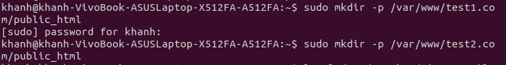

***

### 2. Tạo tập tin cấu hình virtual host

các tập tin cấu hình virtual host của Apache sẽ nằm trong thư mục

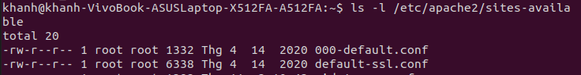

Sao chép 2 virtual host mặc định cho hai tên miền mới:

> sudo cp /etc/apache2/sites-available/000-default.conf /etc/apache2/sites-available/test1.com.conf

> sudo cp /etc/apache2/sites-available/000-default.conf /etc/apache2/sites-available/test2.com.conf

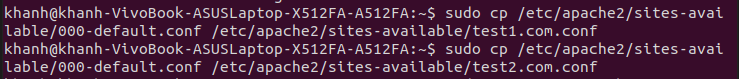

Mở và chỉnh sửa tập tin cấu hình

> sudo nano /etc/apache2/sites-available/test1.com.conf

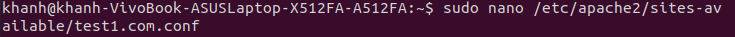

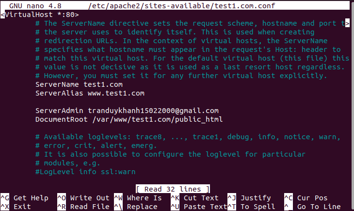

> sudo nano /etc/apache2/sites-available/test2.com.conf

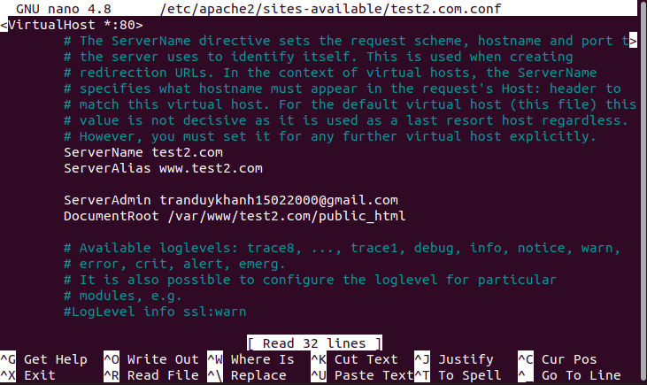

***

### 3. Bật virtual host để các cấu hình hoạt động

bật virtual host

> sudo a2ensite test1.com.conf

> sudo a2ensite test2.com.conf

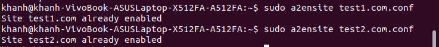

Khởi động lại máy chủ web Apache

> sudo service apache2 restart

  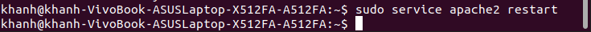

***

### 4. kiểm tra tạo virtual host trên Apache đã đúng chưa

Để kiểm tra tạo virtual host trên Apache xem đã đúng chưa, cần phải tạo 2 tập tin và chạy nó trên trình duyệt.

> sudo nano /var/www/test1.com/public_html/index.html

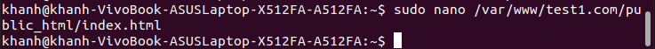

Thêm nội dung để phân biệt

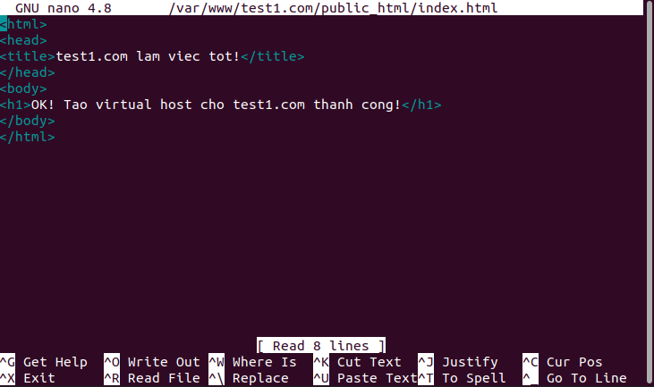

> sudo nano /var/www/test2.com/public_html/index.html

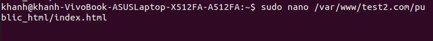

Thêm nội dung để phân biệt

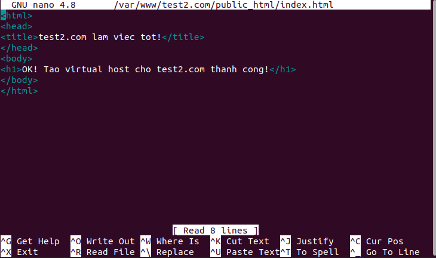

Mở host

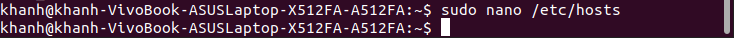

Thêm domain vào host

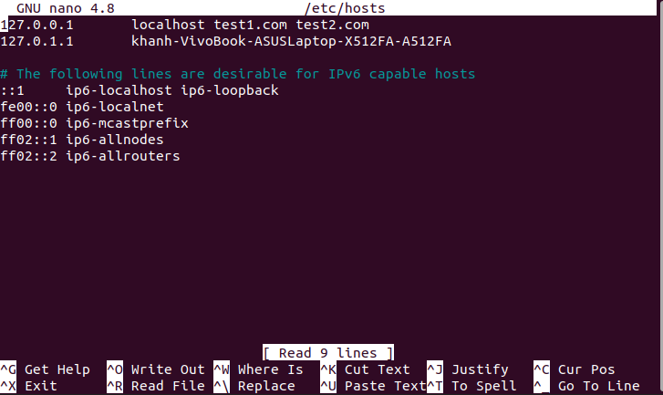

Test trên trình duyệt chrome

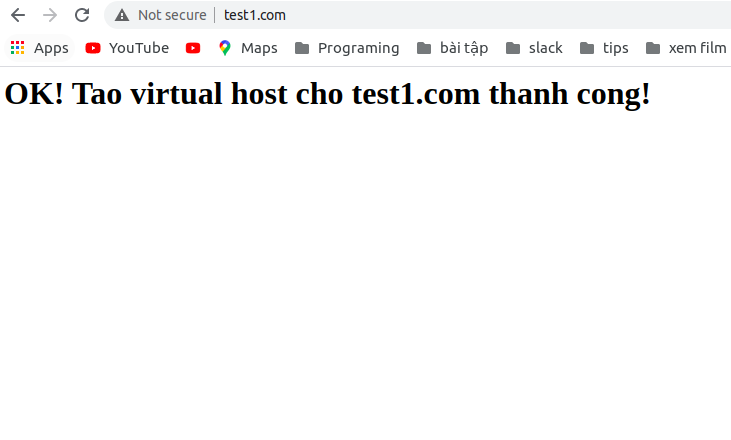

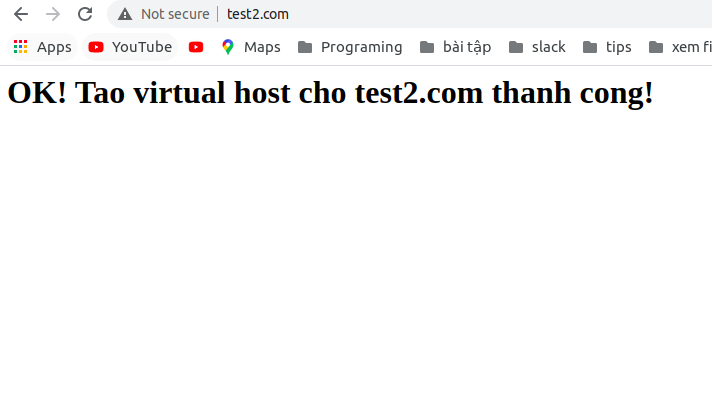

## Câu 2. Tạo trên máy 2 vitrual host để truy cập đến 2 resource web khác nhau nhưng với với nginx.

### 1. Tạo thư mục cho trang web

Tạo hai thư mục

> mkdir -p /var/www/vinasupport_1

> mkdir -p /var/www/vinasupport_2

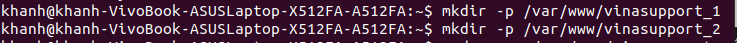

***

### 2. Tạo file index.html 

> sudo nano /var/www/vinasupport_1/index.html

> sudo nano /var/www/vinasupport_2/index.html

nội dung 

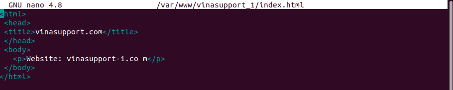

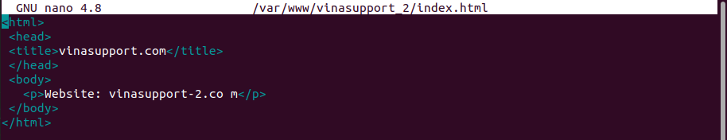

***

### 3. Tạo 2 file Virtual Hosts cho 2 domain:

Tạo 2 file Virtual Hosts

> sudo nano /etc/nginx/sites-available/vinasupport-1.conf

> sudo nano /etc/nginx/sites-available/vinasupport-2.conf

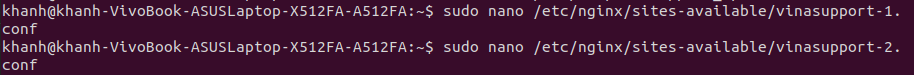

nội dung 

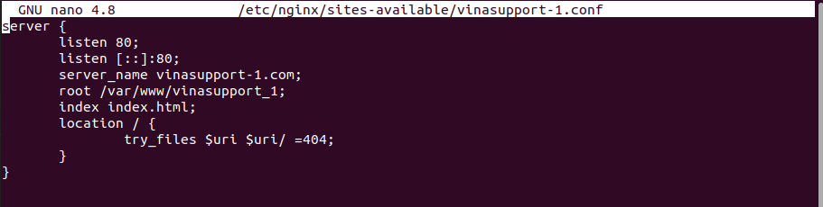

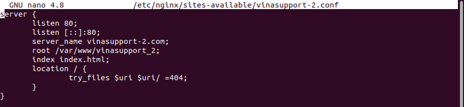

* **listen 80**: Lắng nghe và nhận các kết nối trên cổng 80 (HTTP Port)
* **listen [::]:80**: Tương tự nhưng cho địa chỉ IPv6
* **server_name**: Địa chỉ tên miền
* **root**: Đường đẫn thư mục chứa source code website
* **index**: File sẽ gọi đến đầu tiên
* **location**: Cách trả về tài nguyên trên máy chủ, khi có request tới 1 URL

***

### 4. Sau đó tạo 2 file symbolic

tạo 2 file symbolic

> sudo ln -s /etc/nginx/sites-available/vinasupport-1.conf /etc/nginx/sites-enabled/vinasupport-1.conf

> sudo ln -s /etc/nginx/sites-available/vinasupport-2.conf /etc/nginx/sites-enabled/vinasupport-2.conf

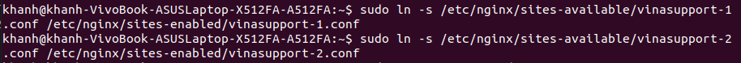

### 5. kiểm tra tạo virtual host trên Nginx

reload lại service của Nginx Web Server để nhận 2 file configs

> sudo systemctl reload nginx

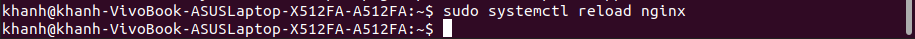

Mở host

> sudo nano /ect/hosts

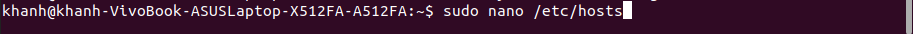

Thêm domain vào host

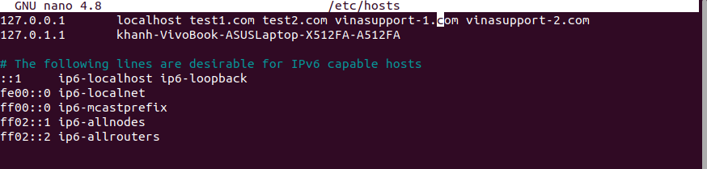

Test trên trình duyệt chrome

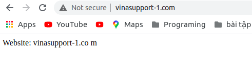

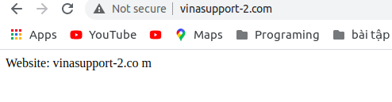

## Câu 3. Làm một vitrual host tại máy em. Khi truy cập vào vào http://demo.24h.dev sẽ show ra dòng chữ Hello world trên trang web.

### 1. Tạo thư mục cho trang web

> sudo mkdir -p /var/www/demo_1

***

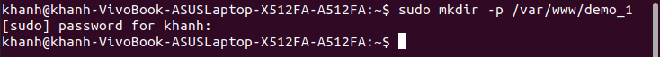

### 2. Tạo file index.html 

> sudo nano /var/www/demo_1/index.html

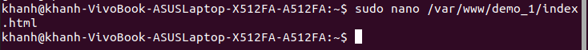

nội dung 

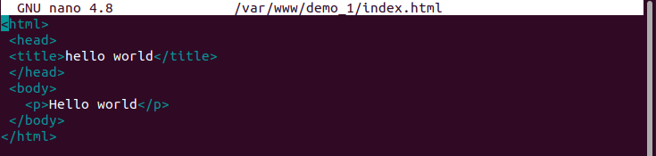

***

### 3. Tạo file Virtual Hosts cho domain:

> sudo nano /etc/nginx/sites-available/demo-1.conf

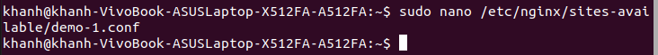

nội dung 

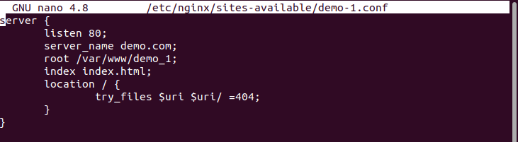

***

### 4. Tạo file symbolic
> sudo ln -s /etc/nginx/sites-available/demo-1.conf /etc/nginx/sites-enabled/demo-1.conf

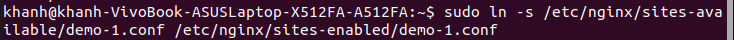

***

### 5. kiểm tra tạo virtual host trên Nginx

> sudo systemctl reload nginx

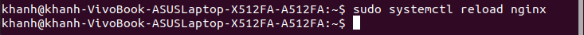

Mở host

> sudo nano /etc/hosts

Thêm domain vào host

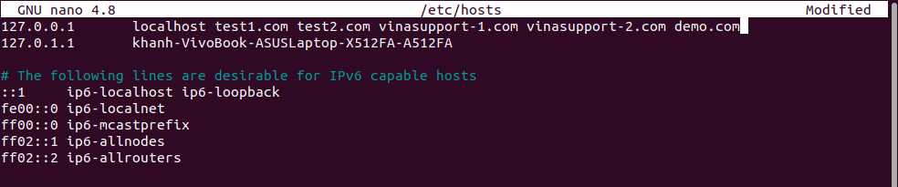

Test trên trình duyệt chrome

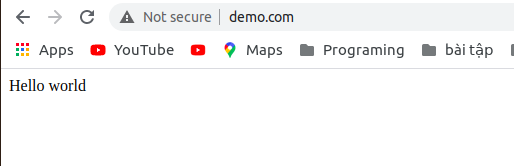